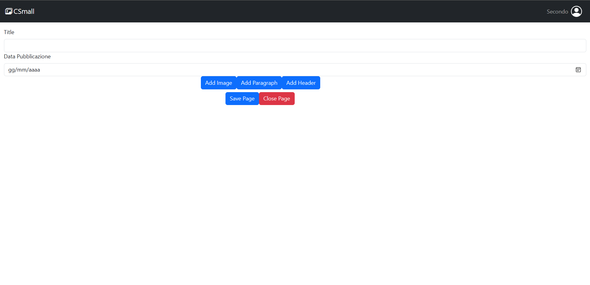

# Exam 1: "CMSmall"

## React Client Application Routes

- Route `/`: Application's FrontOffice
- Route `/backOffice`: Application's BackOffice
- Route `/logIn`: Login page
- Route `/openedPage/:pageId`: Displays all properties of the page with id: pageId
- Route `/modify/:pageId`: Page that allows editing the page with id: pageId
- Route `/add`: Page that allows adding a new page
- Route `/*`: For all non-existing routes

## API Server

### AUTHENTICATION

- POST `/api/session`
  - Description: Performs user login
  - Request body: An object representing user credentials (Content-Type: `application/json`)
  ```
  {
    "username": "DanieleF36",
    "password": "password"
  }
  ```
  - Response: `200 OK` or `401 Unauthorized`
  - Response body: An object representing the user
  ```
  {
    "id": 1,
    "username": "DanieleF36",
    "administrator": 1
  }
  ```

- GET `/api/session/current`
  - Description: Checks if an active session exists
  - Request body: _None_
  - Response: `200 OK` or `401 Unauthorized`
  - Response body: An object representing the user
  ```
  {
    "id": 1,
    "username": "DanieleF36",
    "administrator": 1
  }
  ```

- DELETE `/api/session/current`
  - Description: Deletes the current session
  - Request body: _None_
  - Response: `200 OK`
  - Response body: _None_

### OTHER

- GET `/api/pages`
  - Description: Retrieves all published pages (blocks excluded)
  - Request body: _None_
  - Response: `200 OK` or `500 Internal server error`
  - Response body: An array of objects, each with id, title, publication date, and author
  ```
  [{
    "id": 1,
    "titolo": "La bellezza Olandese",
    "pubblicationDate": "2023-06-25",
    "author": "DanieleF36"
  },
  ...
  ]
  ```

- GET `/api/auth/pages`
  - Description: Retrieves all created pages (blocks excluded)
  - Request body: _None_
  - Response: `200 OK` or `500 Internal server error`
  - Response body: An array of objects with id, title, creation date, publication date, and author
  ```
  [{
    "id": 1,
    "titolo": "La bellezza Olandese",
    "creationDate": "2023-06-25",
    "pubblicationDate": "2023-06-25",
    "author": "DanieleF36"
  },
  ...
  ]
  ```

- GET `/api/auth/pages/<id>`
  - Description: Retrieves the page with the given id, including its blocks
  - Request body: _None_
  - Response: `200 OK`, `404 Not Found`, or `500 Internal server error`
  - Response body: An object describing the page
  ```
  {
    "id": 1,
    "titolo": "La bellezza Olandese",
    "creationDate": "2023-06-25",
    "pubblicationDate": "2023-06-25",
    "author": "DanieleF36",
    "order": [
      {
        "header": "Piantagioni di tulipani",
        "pos": 0
      },
      {
        "url": "images/Olanda.png",
        "pos": 1
      }
      ...
    ]
  }
  ```

- POST `/api/auth/pages`
  - Description: Creates a new page
  - Request body: An object representing a page (Content-Type: `application/json`)
  ```
  {
    "id": 1,
    "titolo": "La bellezza Olandese",
    "creationDate": "2023-06-25",
    "pubblicationDate": "2023-06-25",
    "author": "DanieleF36",
    "order": [
      {
        "header": "Piantagioni di tulipani",
        "pos": 0
      },
      {
        "url": "images/Olanda.png",
        "pos": 1
      }
      ...
    ]
  }
  ```
  - Response: `200 OK`, `422 Unprocessable Entity (invalid request body)`, or `503 Service Unavailable`
  - Response body: The id of the created page

- PUT `/api/auth/pages/<id>`
  - Description: Edits the page with the given id
  - Request body: An object representing a page (Content-Type: `application/json`)
  ```
  {
    "id": 1,
    "titolo": "La bellezza Olandese",
    "creationDate": "2023-06-25",
    "pubblicationDate": "2023-06-25",
    "author": "DanieleF36",
    "order": [
      {
        "header": "Piantagioni di tulipani",
        "pos": 0
      },
      {
        "url": "images/Olanda.png",
        "pos": 1
      }
      ...
    ]
  }
  ```
  - Response: `200 OK`, `422 Unprocessable Entity`, or `503 Service Unavailable`
  - Response body: The id of the updated page

- DELETE `/api/auth/pages/<id>`
  - Description: Deletes the page with the given id
  - Request body: _None_
  - Response: `200 OK` or `503 Service Unavailable`
  - Response body: Number of changes made

- GET `/api/auth/images`
  - Description: Retrieves all images used in blocks
  - Request body: _None_
  - Response: `200 OK` or `500 Internal server error`
  - Response body: An array of objects describing the images
  ```
  [{
    "url": "images/Olanda.png",
    "pos": 1
  },
  ...
  ]
  ```

- PUT `/api/auth/title`
  - Description: Updates the website title
  - Request body: An object with the new title (Content-Type: `application/json`)
  ```
  {
    "title": "CMSmall1"
  }
  ```
  - Response: `200 OK`, `422 Unprocessable Entity`, `401 Unauthorized`, or `503 Service Unavailable`
  - Response body: The id of the title in the database

- GET `/api/auth/title`
  - Description: Retrieves the website title
  - Request body: _None_
  - Response: `200 OK` or `500 Internal server error`
  - Response body:
  ```
  {
    "title": "CMSmall"
  }
  ```

## Database Tables

- Table `informations` - contains: id, title
- Table `users` - contains: id, email, username, name, surname, salt, password, administrator
- Table `pages` - contains: id, title, creationDate, publicationDate, userId
- Table `paragraph` - contains: id, text, pos, pageId
- Table `headers` - contains: id, header, pos, pageId
- Table `images` - contains: id, url
- Table `linksImage` - contains: id, imageId, pageId, pos

## Main React Components

- `ClosedPage`: Used to display a closed page in the homepage; allows opening the page, deleting it, or navigating to its edit page (if in BackOffice)
- `OpenedPage`: Displays a page with all its information; allows editing or deleting it if in BackOffice
- `PagesTable` (in Pages.jsx): Creates a table with all ClosedPage components; allows navigation to the page creation route if in BackOffice
- `LogIn`: Allows user login
- `FormPage`: Used to edit/add a new page
- `Navigation`: Allows logging out, navigating to login, searching a page by name, and (if admin and in BackOffice) changing the site title

## Screenshot
- `Creating a new page`

- `List of all pages`


## User Credentials

| Email                         | Username    | Password | Administrator |
|------------------------------|-------------|----------|----------------|
| daniele.femia@outlook.com    | DanieleF36  | password | Yes            |
| daniele.giochi@outlook.com   | Secondo     | password | No             |
| peppe@email.it               | Giuseppe23  | password | No             |
| Andrea@email.it              | Andrea04    | password | No             |
